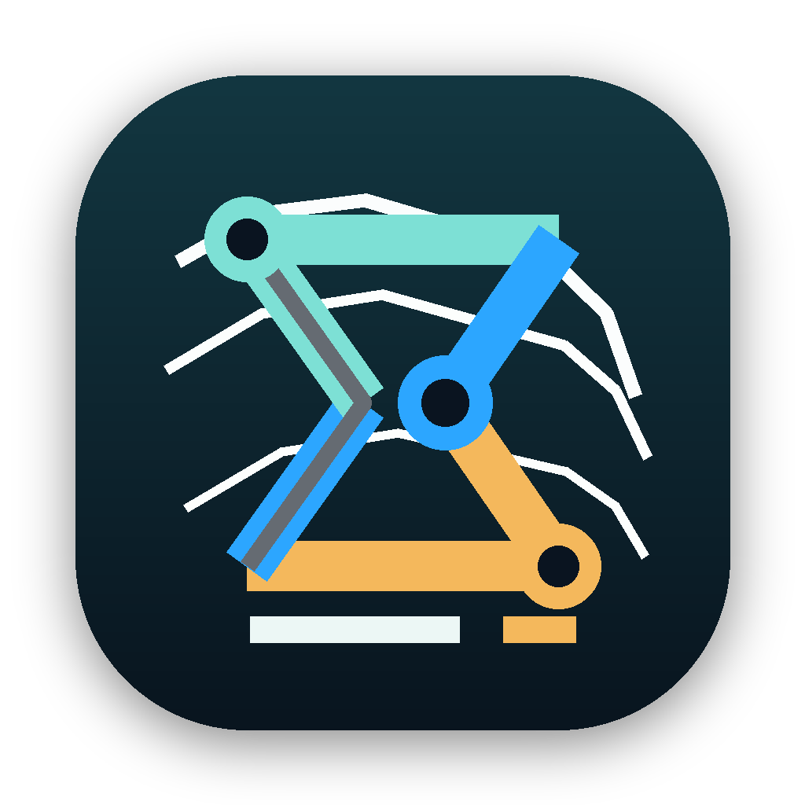

<p align="center">
  
</p>

# EvoMap Console

[](https://github.com/owenshen0907/evomap-console/actions/workflows/ci.yml)

A native local-first macOS operator console for EvoMap workflows: nodes, skills, services, orders, credits, and paid Knowledge Graph APIs.

> Independent project notice: this repository is not an official EvoMap product unless this README is updated to state otherwise.

## Why This Exists

EvoMap workflows touch several surfaces: node handshakes, `node_secret` storage, skill publishing, marketplace services, task/order tracking, credits, and Knowledge Graph APIs. EvoMap Console keeps those daily operator tasks in one Mac app without requiring a user-owned backend.

## Current Capabilities

- Run the live `/a2a/hello` node handshake and store returned `node_secret` values in macOS Keychain.
- Poll authenticated `/a2a/heartbeat` and inspect task, event, peer, and accountability snapshots.
- Import local `SKILL.md` files and publish/update/rollback/manage official Skill Store entries.
- Browse/search Services, publish/update/archive services, place orders, refresh orders, accept submissions, and submit ratings.
- Track credits, refresh official account balance when an API key is available, list bounty-backed tasks, and claim selected bounty tasks.
- Query and ingest paid Knowledge Graph data through `/kg/status`, `/kg/my-graph`, `/kg/query`, and `/kg/ingest` with a Keychain-backed API key.
- Switch UI language between English, Simplified Chinese, Japanese, or system language.

## Security Model

- Runtime credentials are stored in macOS Keychain, not in repository files.
- `node_secret` values are stored per EvoMap sender ID.
- Knowledge Graph API keys are stored through the app settings flow.
- Do not include real claim URLs, account balances, node IDs, API keys, or private screenshots in issues or pull requests.

See `SECURITY.md` for reporting and audit guidance.

## Build From Source

Requirements:

- macOS with Xcode installed
- macOS deployment target: `15.0`
- Optional: `xcodegen` if regenerating the project from `project.yml`

Build:

```bash
xcodebuild -project EvomapConsole.xcodeproj -scheme EvomapConsole -configuration Debug build
```

Regenerate the Xcode project after changing `project.yml`:

```bash
xcodegen generate
```

Run the open-source readiness audit:

```bash
./scripts/open_source_audit.sh
```

## Project Docs

- Product plan: `docs/PLAN.md`
- Detailed design: `docs/DESIGN.md`
- Brand assets: `docs/BRAND.md`
- Open-source checklist: `docs/OPEN_SOURCE.md`
- Publishing guide: `docs/PUBLISHING.md`
- Changelog: `CHANGELOG.md`
- UI references: `docs/UI_REFERENCES.md`

## Repository Structure

```text
App/                         SwiftUI app source
App/Assets.xcassets/          macOS app icon assets
assets/brand/                 logo and wordmark assets
docs/                         product, design, brand, and release notes
scripts/open_source_audit.sh  local pre-publish audit script
project.yml                   XcodeGen project definition
```

## Current Phase

Status: implementation.

Next engineering work:

- live-validate inferred marketplace payloads with a real EvoMap account
- complete the remaining `Activity` workspace
- close the bounty flow loop with publish/complete task actions after endpoint validation
- add screenshots after redacting all private account and node data

## License

MIT. See `LICENSE`.
